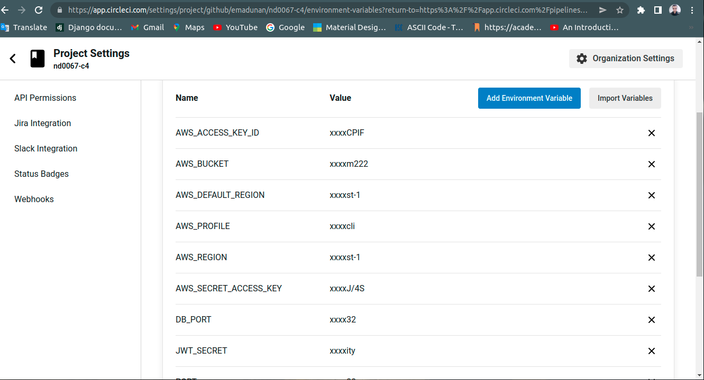
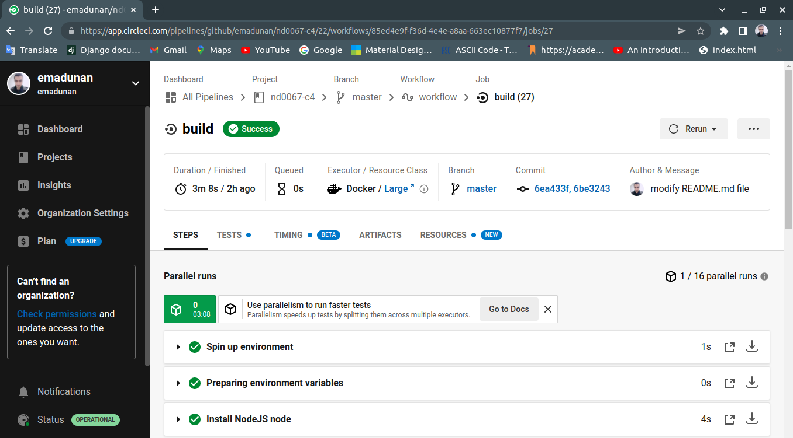
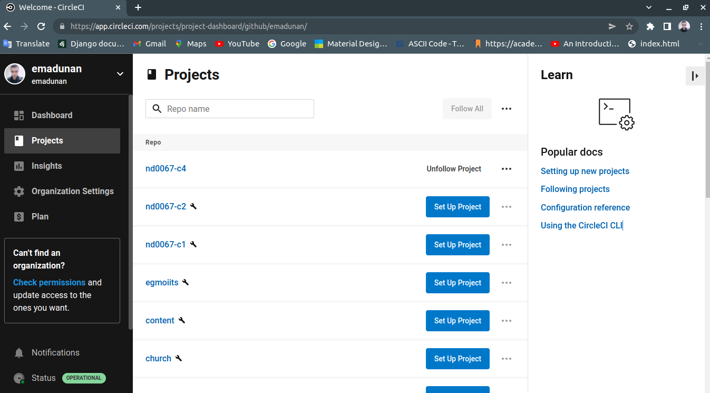

# Udagram

A Full-Stack web application where visitors can freely register without charges and post their feeds in the web application. The application consists of an Express API runs on Nodejs runtime and an Angular frontend application.

Here is the link for the frontend [Udagram Application](http://udagram222.s3-website-us-east-1.amazonaws.com).

### **AWS** *services needed for running the application*:

#### ***AWS RDS*** for the database: Endpoint "database-1.c9pyylv2hx9y.us-east-1.rds.amazonaws.com" on Port "5432"


#### ***AWS ElasticBeanstalk*** for the API [http://udagram-api-dev222.us-east-1.elasticbeanstalk.com](http://udagram-api-dev222.us-east-1.elasticbeanstalk.com)


#### ***AWS S3*** for web hosting [http://udagram222.s3-website-us-east-1.amazonaws.com](http://udagram222.s3-website-us-east-1.amazonaws.com)


***

### CircleCI Pipeline with Github

#### Setup the secrets in CircleCi and send them to EB


#### Latest working CircleCi build


***

# Udagram Application Infrastructure Description

## Services need to run in order to deploy the application
- AWS Relational Database Service (RDS)
- AWS Elastic Beanstalk (EB)
- AWS Simple Storage Service (S3)
- CircleCI

***

### AWS Relational Database Service (RDS):
Database environment that hosts a postgresql database engine version 13.4. The database endpoint is "database-1.c9pyylv2hx9y.us-east-1.rds.amazonaws.com" and running on port 5432.


***

### AWS Elastic Beanstalk (EB):
An application server that hosts a backend API for Udagram application with NodeJS version 16 running on 64bit Linux 2/5.5.1 platform. The API Url is [udagram-api-dev222.us-east-1.elasticbeanstalk.com](http://udagram-api-dev222.us-east-1.elasticbeanstalk.com)


***

### AWS Simple Storage Service (S3):
Amazone Storage Service that contains buckets for the backend application which is served by elastic beanstalk and the frontend Angular application served by S3.


***

### CircleCI:
A service for continues Integeration and continues deployment. CircleCI is connected to my github account and linked to the master branch to the Udagram application repository (nd0067)


***

### Application Dependencies

```
- A RDS database engine 13.4 running Postgres on port 5432.

- Node v16.15.1 Node.js 16 running on 64bit Amazon Linux 2/5.5.1.

- npm 6.14.8 (LTS) or more recent.

- AWS CLI v2.

- A S3 bucket for hosting the Angular frontend application and the backend API hosted by Elastic Beanstalk Enivronment.

```

***

# Pipeline Process
-After pushing commited code to github repository, CircleCI detect the changes since it was previosly linked to the github repository, then execute pipelines as it was defined in the config.yml file as follows:
- Preparing the environment
- Install the Frontend and backend dependencies
- Build the application components
- Deploy the application


***

## Testing

This project contains two different test suite: unit tests and End-To-End tests(e2e). Follow these steps to run the tests.

1. `cd starter/udagram-frontend`
1. `npm run test`
1. `npm run e2e`

### Unit Tests:

Unit tests are using the Jasmine Framework.

### End to End Tests:

The e2e tests are using Protractor and Jasmine.

## Built With

- [Angular](https://angular.io/) - Single Page Application Framework
- [Node](https://nodejs.org) - Javascript Runtime
- [Express](https://expressjs.com/) - Javascript API Framework

## License

[License](LICENSE.txt)
